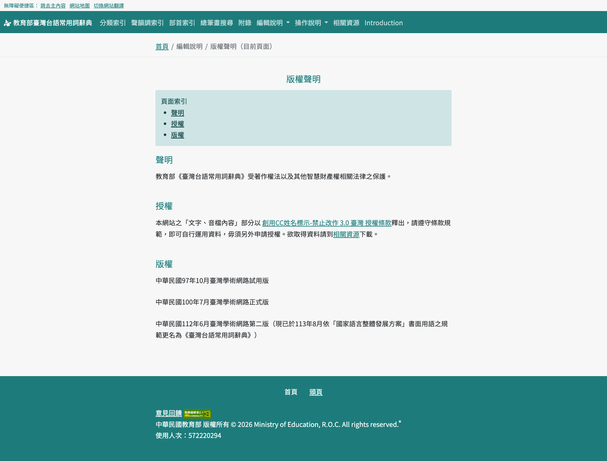

# KipSutianDataMirror

Data mirror for ChhoeTaigi KipSutian. This site provides direct access to the extracted KipSutian audio data. The files are hosted on GitHub Pages for easy access.

## Chu-liāu Pán-koân

版權聲明
- https://sutian.moe.edu.tw/zh-hant/piantsip/pankhuan-singbing/
- [創用CC姓名標示-禁止改作 3.0 臺灣 授權條款](https://creativecommons.org/licenses/by-nd/3.0/tw/)

## Latest Version

* **Version ID:** `20260503-2330`
* **Last Updated:** 2026-05-03

You can check [**manifest.json**](./public/manifest.json) for the latest version information programmatically.

## Accessing Files

The files are organized by version. The latest files are in `public/20260503-2330/`.

### 1. Entries Audio (`imtong/sutiau/`)

* **Base URL:** `https://chhoetaigi.github.io/KipSutianDataMirror/public/20260503-2330/imtong/sutiau/`
* **Structure:** `{filename}`
* **Example:** `https://chhoetaigi.github.io/KipSutianDataMirror/public/20260503-2330/imtong/sutiau/1(1).mp3`

### 2. Example Sentences Audio (`imtong/leku/`)

* **Base URL:** `https://chhoetaigi.github.io/KipSutianDataMirror/public/20260503-2330/imtong/leku/`
* **Structure:** `{filename}`
* **Example:** `https://chhoetaigi.github.io/KipSutianDataMirror/public/20260503-2330/imtong/leku/1-1-1.mp3`

### 3. Text Data (Dictionary & ODS)

* [**KipSutianData.csv** (Dictionary Data CSV)](./public/20260503-2330/bunji/KipSutianData.csv)
* [**KipSutianData.json** (Dictionary Data JSON)](./public/20260503-2330/bunji/KipSutianData.json)
* [**KipSutianData.ods** (Original Data Source)](./public/20260503-2330/tangloo/KipSutianData.ods)

## Chu-liāu bāng-chí

辭典資料下載
1. [辭典文字資料下載（KipSutianData.ods）](https://sutian.moe.edu.tw/media/senn/ods/kautian.ods)
2. [詞條音檔wav下載（sutiau-wav.zip）](https://sutian.moe.edu.tw/media/senn/sutiau-wav.zip)
3. [詞條音檔mp3下載（sutiau-mp3.zip）](https://sutian.moe.edu.tw/media/senn/sutiau-mp3.zip)
4. [例句音檔wav下載（leku-wav.zip）](https://sutian.moe.edu.tw/media/senn/leku-wav.zip)
5. [例句音檔mp3下載（leku-mp3.zip ）](https://sutian.moe.edu.tw/media/senn/leku-mp3.zip)

## Source

Original data source: <https://sutian.moe.edu.tw/>
